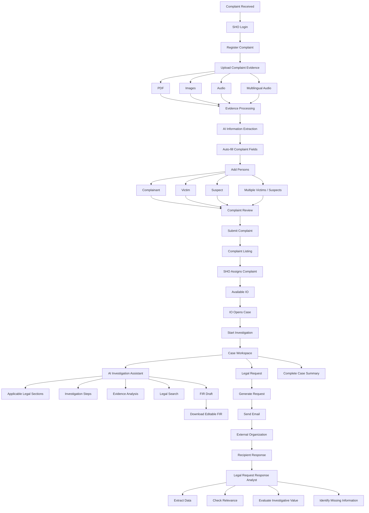
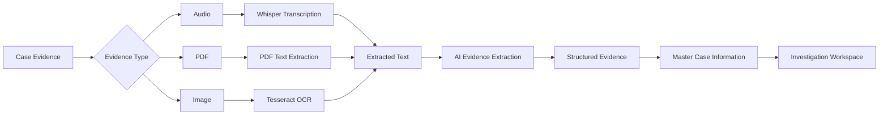
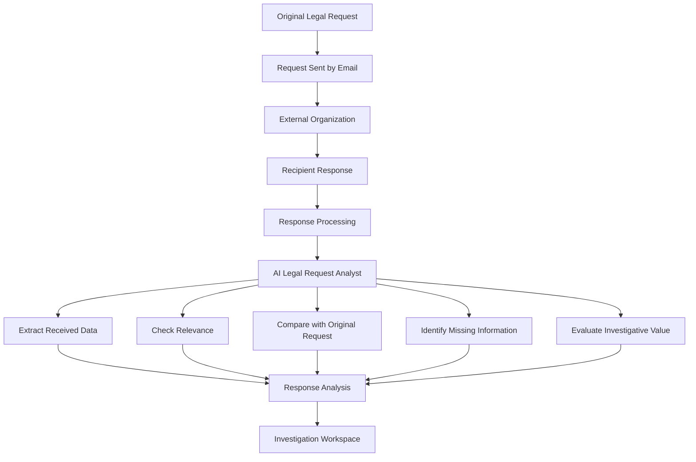
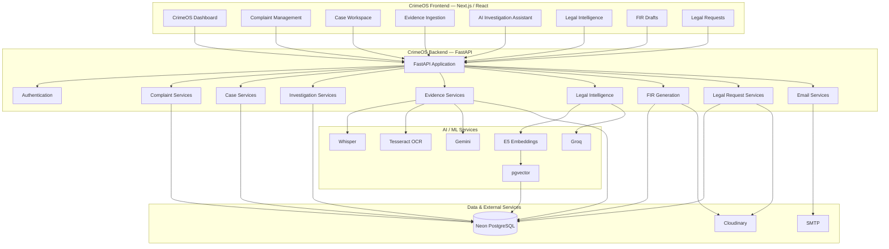

# ⚖️ CrimeOS — AI-Powered Police Investigation & Legal Intelligence Platform

<p align="center">
  <b>Team VectorMinds</b>
</p>

<p align="center">
  AI-powered complaint management, investigation assistance, evidence intelligence, legal intelligence, and case management platform for modern police workflows.
</p>

---

## 🏆 E-Rakshak Hackathon 2026

### Team: **VectorMinds**

| Role           | Team Member              |
| -------------- | ------------------------ |
| 🏆 Team Leader | **Harshini J**           |
| Team Member    | **Manushri Swaminathan** |
| Team Member    | **Srinith Nangunoori**   |
| Team Member    | **Vyomini Joshi**        |

---

# 🌐 Live Application

### Frontend — CrimeOS Police Portal

**https://crimeos-frontend.onrender.com/**

### Backend — CrimeOS FastAPI API

**https://crimeos.onrender.com/**

### Backend Health Check

**https://crimeos.onrender.com/health**

---

# 📌 Table of Contents

* [Overview](#-overview)
* [Problem Statement](#-problem-statement)
* [Our Solution](#-our-solution)
* [User Roles](#-user-roles)
* [Complete System Workflow](#-complete-system-workflow)
* [SHO Workflow](#-sho-workflow)
* [IO Workflow](#-io-workflow)
* [AI Investigation Assistant](#-ai-investigation-assistant)
* [Evidence Intelligence](#-evidence-intelligence)
* [Legal Intelligence](#-legal-intelligence)
* [FIR Generation](#-fir-generation)
* [Legal Request System](#-legal-request-system)
* [Legal Request Response Analysis](#-legal-request-response-analysis)
* [Case Summary](#-case-summary)
* [System Architecture](#-system-architecture)
* [Technology Stack](#-technology-stack)
* [AI/ML Components](#-aiml-components)
* [Project Structure](#-project-structure)
* [API Documentation](#-api-documentation)
* [Database](#-database)
* [Environment Configuration](#-environment-configuration)
* [Local Installation](#-local-installation)
* [Running the Application](#-running-the-application)
* [Testing](#-testing)
* [Deployment](#-deployment)
* [Security](#-security)
* [Innovation](#-innovation)
* [Future Scope](#-future-scope)
* [Responsible AI](#-responsible-ai)
* [Project Impact](#-project-impact)
* [Third-Party Technologies](#-third-party-technologies)
* [Quick Links](#-quick-links)

---

# 🔎 Overview

**CrimeOS** is an AI-powered police investigation and legal intelligence platform.

The platform is designed around the complete lifecycle of a criminal complaint:

```text
Complaint
    ↓
Evidence Ingestion
    ↓
Information Extraction
    ↓
Complaint Review
    ↓
Complaint Submission
    ↓
SHO Assignment
    ↓
IO Investigation
    ↓
AI Investigation Assistant
    ↓
Evidence Analysis
    ↓
Legal Intelligence
    ↓
Investigation Suggestions
    ↓
Legal Requests
    ↓
External Response
    ↓
Response Analysis
    ↓
FIR Draft
    ↓
Complete Case Summary
```

Instead of using separate systems for complaint registration, evidence processing, legal research, investigation planning, external information requests and document generation, CrimeOS brings these activities into a **single case-centric workspace**.

---

# 🎯 Problem Statement

Police investigations generate information from many different sources:

* Written complaints
* Scanned documents
* Images
* Audio statements
* Victim information
* Suspect information
* Witness/complainant information
* Legal provisions
* Investigation records
* External organization responses
* Digital evidence

A large amount of this information is unstructured.

Officers may have to manually:

1. Enter complaint information.
2. Read documents and statements.
3. Extract relevant information.
4. Identify applicable legal sections.
5. Determine investigation steps.
6. Analyze evidence.
7. Prepare FIR documentation.
8. Send information requests to external organizations.
9. Examine responses received from those organizations.
10. Consolidate all information into a case summary.

This can make investigations time-consuming and difficult to manage.

---

# 💡 Our Solution

CrimeOS provides a unified digital investigation environment with two primary roles:

```text
                    CRIMEOS
                       │
              ┌────────┴────────┐
              │                 │
             SHO               IO
              │                 │
      Complaint Management   Investigation
              │                 │
      Register Complaint      Case Workspace
      Upload Evidence         AI Assistant
      Review Complaint        Evidence Analysis
      View Complaints         Legal Intelligence
      Search / Filter         Investigation Steps
      Assign Case             Legal Requests
                             Response Analysis
                             FIR Generation
                             Case Summary
```

The platform uses AI to assist officers with information extraction, evidence analysis, legal intelligence and investigation support while keeping the officer in control of the final decisions.

---

# 👥 User Roles

CrimeOS currently has two primary roles:

## 👮 SHO — Station House Officer

The SHO is responsible for the **complaint registration and assignment workflow**.

The SHO can:

* Register complaints.
* Upload complaint-related evidence.
* Upload PDF documents.
* Upload images.
* Upload audio.
* Process multilingual audio.
* Automatically extract information from uploaded material.
* Review extracted complaint information.
* Add complainants.
* Add victims.
* Add suspects.
* Add multiple victims.
* Add multiple suspects.
* Review the complete complaint before submission.
* Submit complaints.
* View complaint listings.
* Search complaints.
* Filter complaints.
* View available Investigation Officers.
* Assign complaints/cases to available IOs.

---

## 🕵️ IO — Investigation Officer

The IO is responsible for the **investigation workflow**.

The IO can:

* View assigned cases.
* Start investigation.
* View complete case details.
* Analyze evidence.
* Use the AI Investigation Assistant.
* Get applicable legal-section suggestions.
* Get investigation-step suggestions.
* Perform semantic legal searches.
* Generate FIR drafts.
* Download FIR documents.
* Create legal requests.
* Request case-related information from external organizations.
* Send legal requests through email.
* Analyze responses received from organizations.
* Determine the relevance of received information.
* Understand how received information can help the investigation.
* View a consolidated case summary.

---

# 🔄 Complete System Workflow



---

# 👮 SHO Workflow

## 1. Complaint Registration

The SHO starts the complaint registration process.

CrimeOS allows the SHO to upload documents related to the complaint before filling in the complete complaint form.

Supported input types include:

* PDF
* Images
* Audio

Audio can contain multiple languages, including:

* English
* Hindi
* Gujarati

---

## 2. Complaint Evidence Processing

The uploaded material is processed by the CrimeOS ingestion pipeline.

```text
Uploaded Evidence
       ↓
   File Detection
       ↓
┌──────┼────────┐
│      │        │
PDF   Image    Audio
│      │        │
PDF   OCR     Whisper
│      │        │
└──────┼────────┘
       ↓
  Extracted Text
       ↓
    AI Analysis
       ↓
Structured Information
```

The system attempts to extract information that can be populated into the complaint fields.

---

## 3. Automatic Complaint Field Extraction

Information that can be extracted from the uploaded material can be used to populate the relevant complaint form fields.

The SHO can review and modify the extracted information before submitting the complaint.

This reduces repetitive manual data entry.

---

# 👤 People Management

CrimeOS provides separate input cards for people associated with the complaint.

The complaint can contain:

### Complainant

Information about the person registering/reporting the complaint.

### Victim

Information about the victim or victims associated with the incident.

### Suspect

Information about suspected individuals.

The system supports:

```text
Complaint
   │
   ├── Complainant
   │
   ├── Victim 1
   ├── Victim 2
   ├── Victim 3
   │
   ├── Suspect 1
   ├── Suspect 2
   └── Suspect 3
```

This allows complaints involving multiple victims and suspects to be represented.

---

# 🔍 Complaint Review

Before submitting a complaint, the SHO receives a final review screen.

The review brings together:

* Complaint information
* Extracted information
* Complainant information
* Victim information
* Suspect information
* Uploaded evidence
* Other entered fields

The SHO can verify the information before submission.

---

# 📋 Complaint Listing

After submission, complaints appear in the complaint listing page.

The complaint listing provides centralized access to information received during complaint registration and evidence ingestion.

The page supports:

* Complaint search
* Filters
* Complaint details
* Extracted information
* Complaint status
* Assignment-related information

---

# 🧑‍✈️ Assigning a Case

The SHO can view available Investigation Officers.

A complaint can then be assigned to an available IO.

```text
SHO
 │
 ▼
Complaint
 │
 ▼
Available IOs
 │
 ▼
Select IO
 │
 ▼
Assign
 │
 ▼
Investigation Case
```

Once assigned, the IO can access the case through the investigation workspace.

---

# 🕵️ IO Investigation Workflow

The IO is responsible for the major investigation portion of CrimeOS.

After receiving an assigned case, the IO can open the case and start the investigation.

---

# 📂 Case Workspace

The case workspace provides a centralized view of the investigation.

The case can contain:

* Complaint information
* Complainant
* Victims
* Suspects
* Evidence
* Investigation information
* Legal intelligence
* AI analysis
* Legal requests
* Legal-request responses
* FIR drafts
* Case summary

The case page also supports searching and filtering.

---

# 🤖 AI Investigation Assistant

The AI Investigation Assistant is one of the core features of CrimeOS.

It provides investigation-oriented assistance based on the information available for the case.

The assistant can help with:

### Applicable Legal Sections

The assistant analyzes the case context and suggests potentially applicable legal sections.

The IO can review the suggested sections before using them in the investigation or FIR workflow.

---

### Investigation Steps

The AI assistant can suggest investigation steps based on the given case.

```text
Case Details
     ↓
AI Analysis
     ↓
Potential Investigation Directions
     ↓
Suggested Investigation Steps
     ↓
IO Review
```

The suggestions are intended to help the IO structure the investigation and identify potentially useful investigative directions.

---

### Evidence Analysis

The IO can upload evidence related to the case.

The AI system can analyze information extracted from:

* Images
* PDFs
* Audio
* Text
* Other supported case-related evidence

The objective is to convert unstructured evidence into useful investigation information.

---

# 🧠 Evidence Intelligence Pipeline



---

# 🎙️ Audio Processing

CrimeOS supports audio evidence ingestion.

The audio processing pipeline uses Whisper for transcription.

```text
Audio
 ↓
Whisper
 ↓
Transcript
 ↓
AI Processing
 ↓
Structured Information
```

This enables officers to use recorded statements and other audio evidence as part of the investigation workflow.

---

# 📄 PDF Processing

PDF evidence is processed through the backend ingestion pipeline.

```text
PDF
 ↓
PDF Text Extraction
 ↓
Extracted Content
 ↓
AI Processing
 ↓
Investigation Information
```

---

# 🖼️ Image Processing

Images and scanned documents can be processed through OCR.

```text
Image
 ↓
Tesseract OCR
 ↓
Extracted Text
 ↓
AI Processing
 ↓
Structured Information
```

---

# 🧠 Master Evidence Fusion

Information extracted from different evidence sources can be merged into the master case information.

```text
Audio ──────┐
            │
PDF ────────┼──► Extracted Information
            │
Images ─────┘
                    ↓
              Master Agent
                    ↓
             Structured Case
                    ↓
              Case Database
```

This allows information from multiple evidence sources to contribute to the same investigation.

---

# 📚 Legal Intelligence

CrimeOS contains an AI-assisted legal intelligence system.

The system allows an officer to search for relevant legal provisions using natural-language case descriptions.

Instead of requiring the officer to know the exact legal section beforehand, the system uses semantic similarity to retrieve relevant information.

---

# ⚖️ Legal Knowledge Base

The legal intelligence system is designed to work with:

* Bharatiya Nyaya Sanhita — BNS
* Bharatiya Nagarik Suraksha Sanhita — BNSS
* Bharatiya Sakshya Adhiniyam — BSA
* Indian Penal Code — IPC
* Code of Criminal Procedure — CrPC
* Indian Evidence Act — IEA

Historical and current legal provisions can be connected through old-to-new act mappings.

---

# 🔎 Semantic Legal Search

```text
Officer enters case description
             ↓
     E5 Embedding Model
             ↓
       Query Vector
             ↓
      pgvector Search
             ↓
   Relevant Legal Sections
             ↓
     Crosswalk Mapping
             ↓
      AI Synthesis
             ↓
     Officer Interface
```

The system uses vector similarity rather than only exact keyword matching.

---

# 📊 Legal Intelligence Architecture

```text
                 Case Description
                        │
                        ▼
              Hugging Face E5
                 Embeddings
                        │
                        ▼
              1024-Dimensional
                   Vector
                        │
                        ▼
              PostgreSQL + pgvector
                        │
                        ▼
              Similarity Search
                        │
                        ▼
              Relevant Sections
                        │
                        ▼
               Old/New Crosswalk
                        │
                        ▼
                 AI Synthesis
                        │
                        ▼
             Investigation Guidance
```

---

# 📄 FIR Draft Generation

The AI Assistant includes an FIR draft generation workflow.

The IO can review the applicable legal sections and use the selected information to generate an FIR draft.

```text
Case
 ↓
AI Assistant
 ↓
Suggested Legal Sections
 ↓
IO Reviews / Selects Sections
 ↓
FIR Draft
 ↓
Word Document
```

The generated document can be downloaded as an editable `.docx` file.

The officer can review and edit the document before any official use.

---

# 📡 Legal Request System

CrimeOS provides a dedicated Legal Request feature for requesting case-related information from external organizations.

Possible recipient categories include:

* Telecom operators
* Social-media platforms
* Government organizations
* Other authorized organizations

---

# 📤 Creating a Legal Request

The IO can create a legal request from the case workspace.

The workflow is:

```text
Case
 ↓
Legal Request
 ↓
Enter Request Information
 ↓
Select Recipient
 ↓
Generate Request
 ↓
Generate PDF
 ↓
Send Email
```

The generated request is converted into a PDF and can be sent to the recipient organization through email.

---

# 📧 Email Dispatch

CrimeOS integrates SMTP email functionality.

The legal request workflow can:

1. Generate the request.
2. Generate the corresponding PDF.
3. Store/upload the document.
4. Send the request to the recipient email.
5. Allow the recipient to respond.

---

# 📥 Legal Request Response Analysis

CrimeOS also addresses the next stage of the workflow: **what happens after the organization responds?**

When a recipient replies to a legal request, the response can be analyzed by the Legal Request Analyst.

The system helps the IO understand:

* What information was received?
* What data was provided?
* Is the received data relevant?
* Does the response address the original request?
* Is any requested information missing?
* How can the information help the investigation?
* What important findings are present in the response?

---

# 🧠 Legal Request Analysis Flow



This allows CrimeOS to close the loop between **requesting external information and understanding the investigative value of the response**.

---

# 📋 Complete Case Summary

CrimeOS provides a consolidated case-summary view.

The case summary brings together information collected throughout the investigation.

Depending on the available information, it can include:

* Complaint details
* Complainant information
* Victim information
* Suspect information
* Evidence
* Evidence analysis
* Legal-section information
* Investigation suggestions
* Legal requests
* Recipient information
* Request responses
* Response analysis
* FIR information
* Other case information

The objective is to give the IO a complete picture of the investigation from one place.

---

# 🏗️ System Architecture



---

# 🛠️ Technology Stack

## Frontend

* Next.js
* React
* TypeScript / JavaScript
* Tailwind CSS

## Backend

* Python
* FastAPI
* Uvicorn
* SQLAlchemy
* Pydantic

## Database

* PostgreSQL
* Neon Serverless PostgreSQL
* pgvector

## AI / ML

* Google Gemini
* Groq
* Hugging Face
* E5 embeddings
* Whisper
* Tesseract OCR

## Document Processing

* PDFPlumber
* ReportLab
* python-docx

## Cloud & Infrastructure

* Render
* Cloudinary
* SMTP

---

# 🤖 AI/ML Components

| Component              | Role                                                      |
| ---------------------- | --------------------------------------------------------- |
| **Whisper**            | Audio transcription                                       |
| **Tesseract OCR**      | Extract text from images/scanned documents                |
| **PDFPlumber**         | PDF text extraction                                       |
| **Gemini**             | Evidence extraction and structured information processing |
| **Combo Master Agent** | Evidence fusion and master-case information processing    |
| **E5 Embeddings**      | Semantic representation of legal queries                  |
| **pgvector**           | Vector similarity search                                  |
| **Groq**               | AI synthesis and investigation intelligence               |

---

# 📁 Project Structure

```text
CrimeOS/
│
├── frontend/
│   ├── app/
│   ├── components/
│   ├── hooks/
│   ├── lib/
│   ├── services/
│   ├── public/
│   ├── package.json
│   └── ...
│
├── backend/
│   │
│   ├── app/
│   │   ├── config/
│   │   │   └── Configuration and external service clients
│   │   │
│   │   ├── core/
│   │   │   └── Authentication and security utilities
│   │   │
│   │   ├── routes/
│   │   │   ├── auth.py
│   │   │   ├── investigation.py
│   │   │   ├── complaint.py
│   │   │   ├── complainants.py
│   │   │   ├── victims.py
│   │   │   ├── suspects.py
│   │   │   ├── evidences.py
│   │   │   ├── case.py
│   │   │   ├── fir_drafts.py
│   │   │   ├── legal_requests.py
│   │   │   ├── legal_section_intelligence.py
│   │   │   ├── person_photo.py
│   │   │   ├── email_test.py
│   │   │   ├── audio.py
│   │   │   ├── pdf.py
│   │   │   ├── image.py
│   │   │   └── combo.py
│   │   │
│   │   ├── schemas/
│   │   │   └── Pydantic schemas
│   │   │
│   │   ├── services/
│   │   │   ├── Complaint services
│   │   │   ├── Investigation services
│   │   │   ├── Evidence processing
│   │   │   ├── Legal intelligence
│   │   │   ├── Legal requests
│   │   │   ├── Email services
│   │   │   └── Document generation
│   │   │
│   │   └── main.py
│   │
│   ├── database/
│   │   ├── db.py
│   │   └── init_db.py
│   │
│   ├── investigation/
│   │   ├── tests/
│   │   ├── embedding.py
│   │   ├── legal_library_router.py
│   │   ├── cases.py
│   │   ├── llm_synthesis.py
│   │   ├── query_builder.py
│   │   ├── retrieval.py
│   │   └── README.md
│   │
│   ├── models/
│   │   └── SQLAlchemy ORM models
│   │
│   ├── scripts/
│   │   ├── seed_db.py
│   │   ├── seed_landmarks.py
│   │   └── seed_mappings.py
│   │
│   ├── .env
│   └── requirements.txt
│
└── README.md
```

---

# 📡 API Documentation

The backend is built using FastAPI.

The API can be explored through FastAPI's automatically generated documentation when running the backend.

```text
http://localhost:8000/docs
```

For the deployed backend:

```text
https://crimeos.onrender.com/docs
```

---

# 🔐 Authentication Routes

The application registers the authentication router:

```python
app.include_router(auth_router)
```

The authentication module provides officer registration and login functionality.

| Function | Purpose                |
| -------- | ---------------------- |
| Register | Create officer account |
| Login    | Authenticate officer   |

The application uses JWT-based authentication.

---

# 📋 Complaint Routes

The application registers:

```python
app.include_router(complaints_router)
```

The complaint module handles:

* Complaint registration
* Complaint retrieval
* Complaint listing
* Available IO retrieval
* Complaint categories
* Complaint assignment

Known complaint endpoints from the project interface include:

| Endpoint                      | Method | Purpose                  |
| ----------------------------- | -----: | ------------------------ |
| `/api/complaints`             |   POST | Register complaint       |
| `/api/complaints`             |    GET | Retrieve complaints      |
| `/api/complaints/io`          |    GET | Get available IOs        |
| `/api/complaints/categories`  |    GET | Get complaint categories |
| `/api/complaints/{id}/assign` |   POST | Assign complaint to IO   |

---

# 👤 Person Routes

The application registers separate routers for:

```python
app.include_router(complainants_router)
app.include_router(victims_router)
app.include_router(suspects_router)
```

These modules handle information associated with:

* Complainants
* Victims
* Suspects

The exact endpoint paths are defined inside their individual router files.

---

# 🧾 Evidence Routes

CrimeOS registers:

```python
app.include_router(evidences_router)
```

This router manages case/complaint evidence-related operations.

---

# 🎙️ Audio Route

```python
app.include_router(
    audio.router,
    prefix="/api/v1/audio",
    tags=["Audio"],
)
```

### Known endpoint

```text
POST /api/v1/audio/upload
```

Purpose:

> Upload and process audio evidence.

---

# 📄 PDF Route

```python
app.include_router(
    pdf.router,
    prefix="/api/v1/pdf",
    tags=["PDF"]
)
```

### Known endpoint

```text
POST /api/v1/pdf/upload
```

Purpose:

> Upload and extract information from PDF evidence.

---

# 🖼️ Image Route

```python
app.include_router(
    image.router,
    prefix="/api/v1/image",
    tags=["Image"]
)
```

### Known endpoint

```text
POST /api/v1/image/upload
```

Purpose:

> Upload and OCR-process image evidence.

---

# 🧠 Combo Master Agent Route

```python
app.include_router(
    combo.router,
    prefix="/api/v1/combo",
    tags=["Combo Master Agent"]
)
```

### Known endpoint

```text
POST /api/v1/combo/merge/
```

Purpose:

> Merge information extracted from multiple evidence sources into the master case information.

---

# 🕵️ Investigation Routes

The application registers:

```python
app.include_router(investigation_router)
```

The investigation router handles investigation-related operations.

The system also registers the cases router:

```python
app.include_router(
    cases_router,
    prefix="/api",
    tags=["cases"]
)
```

Known investigation functionality includes:

* Starting investigations
* Viewing cases
* Generating investigation suggestions
* Working with case-level AI intelligence

---

# 🔎 Legal Library Routes

The legal library router is registered with:

```python
app.include_router(
    legal_library_router,
    prefix="/api/legal-library",
    tags=["legal-library"]
)
```

### Known endpoint

```text
GET /api/legal-library/search
```

Purpose:

> Perform semantic search over the legal knowledge base.

---

# ⚖️ Legal Section Intelligence

CrimeOS registers:

```python
app.include_router(
    legal_section_intelligence_router,
    tags=["legal-section-intelligence"]
)
```

This module provides AI-assisted legal-section intelligence.

The exact endpoint paths are defined inside:

```text
app/routes/legal_section_intelligence.py
```

---

# 📄 FIR Draft Routes

The application registers:

```python
app.include_router(
    fir_drafts_router,
    tags=["fir-drafts"]
)
```

Known FIR functionality includes:

| Endpoint                        | Method | Purpose                         |
| ------------------------------- | -----: | ------------------------------- |
| `/api/fir-drafts`               |   POST | Save/create FIR draft           |
| `/api/fir-drafts`               |    GET | Retrieve FIR draft information  |
| `/api/fir-drafts/{id}/download` |    GET | Download editable Word document |

---

# 📡 Legal Request Routes

The application registers:

```python
app.include_router(legal_requests_router)
```

Known functionality includes:

| Endpoint                            | Method | Purpose                    |
| ----------------------------------- | -----: | -------------------------- |
| `/api/legal-requests`               |   POST | Create legal request       |
| `/api/legal-requests/{id}/generate` |   POST | Generate legal-request PDF |
| `/api/legal-requests/{id}/send`     |   POST | Send request through email |

---

# 📧 Email Test Routes

The application registers:

```python
app.include_router(email_test_router)
```

This router is used for email functionality testing.

The exact endpoint paths are defined inside:

```text
app/routes/email_test.py
```

---

# 🧑 Person Photo Routes

The application registers:

```python
app.include_router(person_photo_router)
```

This module handles person-photo related operations.

The exact endpoint paths are defined inside:

```text
app/routes/person_photo.py
```

---

# 🗃️ Case Routes

The application registers:

```python
app.include_router(case.router)
```

and:

```python
app.include_router(
    cases_router,
    prefix="/api",
    tags=["cases"]
)
```

These routes support case-level operations used by the IO investigation workflow.

The exact endpoints are defined inside the corresponding router files.

---

# ❤️ Health Check

CrimeOS exposes:

```text
GET /health
```

Response:

```json
{
  "status": "ok",
  "service": "CrimeOS Backend"
}
```

The deployed health endpoint is:

https://crimeos.onrender.com/health

---

# 🗄️ Database Architecture

CrimeOS uses PostgreSQL as the primary database.

The deployed application uses **Neon Serverless PostgreSQL**.

The database stores structured case information including:

* Users
* Complaints
* Cases
* Complainants
* Victims
* Suspects
* Evidence
* Legal information
* Legal mappings
* FIR drafts
* Legal requests
* Investigation information
* Other case-related records

---

# 🔎 Vector Database / Semantic Search

The legal intelligence system uses PostgreSQL with the `pgvector` extension.

```text
Natural Language Query
        ↓
Embedding Model
        ↓
Query Vector
        ↓
pgvector
        ↓
Cosine Similarity Search
        ↓
Relevant Legal Records
```

This enables semantic retrieval of legal information.

---

# 🔐 Environment Configuration

Create a file:

```text
backend/.env
```

Example:

```env
DATABASE_URL=postgresql://<user>:<password>@<host>/<database>?sslmode=require

JWT_SECRET_KEY=your_jwt_signing_secret_key
JWT_ALGORITHM=HS256
ACCESS_TOKEN_EXPIRE_MINUTES=60

GEMINI_API_KEY=your_gemini_api_key
GOOGLE_API_KEY=your_google_api_key
GROQ_API_KEY=your_groq_api_key
HF_API_TOKEN=your_huggingface_token

CLOUDINARY_CLOUD_NAME=your_cloudinary_name
CLOUDINARY_API_KEY=your_cloudinary_api_key
CLOUDINARY_API_SECRET=your_cloudinary_api_secret

SMTP_HOST=smtp.gmail.com
SMTP_PORT=587
SMTP_USERNAME=your_email@gmail.com
SMTP_PASSWORD=your_gmail_app_password
SMTP_FROM=your_email@gmail.com
```

### Important

Never commit real secrets to GitHub.

The `.env` file should be added to `.gitignore`.

Example:

```gitignore
.env
venv/
__pycache__/
*.pyc
node_modules/
.next/
```

---

# ⚙️ Local Installation

## Prerequisites

Install:

* Git
* Python 3.x
* Node.js
* npm
* PostgreSQL/Neon database access

---

## 1. Clone the Repository

```bash
git clone <repository-url>
cd CrimeOS
```

---

# 🐍 Backend Setup

```bash
cd backend
```

Create a virtual environment:

```bash
python -m venv venv
```

### Windows

```bash
venv\Scripts\activate
```

### Linux/macOS

```bash
source venv/bin/activate
```

Install dependencies:

```bash
pip install -r requirements.txt
```

Create:

```text
backend/.env
```

and configure the required environment variables.

---

# 📚 Seed Legal Database

Run the database seed scripts in order:

```bash
python scripts/seed_db.py
```

```bash
python scripts/seed_landmarks.py
```

```bash
python scripts/seed_mappings.py --csv-dir ./scripts
```

These scripts populate the legal knowledge base and associated legal mappings.

---

# 🚀 Start Backend

From the `backend` directory:

```bash
uvicorn app.main:app --reload --port 8000
```

The local backend will run at:

```text
http://localhost:8000
```

FastAPI Swagger documentation:

```text
http://localhost:8000/docs
```

---

# 💻 Frontend Setup

Open another terminal:

```bash
cd frontend
```

Install dependencies:

```bash
npm install
```

Start the development server:

```bash
npm run dev
```

The frontend will normally be available at:

```text
http://localhost:3000
```

---

# 🧪 Testing

The backend investigation tests can be executed using:

```bash
pytest investigation/tests/
```

---

# ☁️ Deployment Architecture

CrimeOS is deployed using Render for the frontend and backend.

```text
                     INTERNET
                         │
                         ▼
        ┌────────────────────────────┐
        │ CrimeOS Frontend           │
        │ Render                     │
        │ crimeos-frontend.onrender  │
        └─────────────┬──────────────┘
                      │
                      │ HTTPS
                      ▼
        ┌────────────────────────────┐
        │ CrimeOS Backend            │
        │ FastAPI + Uvicorn          │
        │ Render                     │
        │ crimeos.onrender.com       │
        └─────────────┬──────────────┘
                      │
       ┌──────────────┼───────────────┐
       │              │               │
       ▼              ▼               ▼
   Neon DB         AI APIs        Cloud Services
       │              │               │
   PostgreSQL     Gemini/Groq     Cloudinary
   pgvector       Hugging Face   SMTP
                  Whisper
                  Tesseract
```

---

# 🌐 CORS Configuration

The backend allows requests from the local frontend and deployed CrimeOS frontend.

Configured origins:

```python
allow_origins=[
    "http://localhost:3000",
    "https://crimeos-frontend.onrender.com",
]
```

The backend also enables:

```python
allow_credentials=True
allow_methods=["*"]
allow_headers=["*"]
```

---

# 🔒 Security

CrimeOS uses multiple security mechanisms.

### Authentication

JWT-based authentication is used for authenticated users.

### Authorization

Role-based access distinguishes:

* SHO
* IO

### Secrets

API keys and credentials are loaded through environment variables.

### CORS

The backend explicitly allows the local and deployed CrimeOS frontend origins.

### AI Output Verification

AI-generated suggestions are intended to assist officers. They should be reviewed by authorized personnel before official use.

---

# 🌟 Key Features

| Feature                  | Description                               |
| ------------------------ | ----------------------------------------- |
| 👮 SHO Dashboard         | Complaint registration and management     |
| 📋 Complaint Management  | Search, filtering and complaint tracking  |
| 📄 Document Ingestion    | PDF processing                            |
| 🖼️ OCR                  | Image/scanned document text extraction    |
| 🎙️ Audio Transcription  | Audio-to-text processing                  |
| 🌐 Multilingual Evidence | English, Hindi and Gujarati audio support |
| 👤 Person Management     | Complainants, victims and suspects        |
| 🕵️ Case Management      | Assign and investigate cases              |
| 🤖 AI Assistant          | Investigation and legal assistance        |
| ⚖️ Legal Intelligence    | Semantic legal search                     |
| 🔍 Evidence Analysis     | AI-assisted evidence analysis             |
| 📑 FIR Generation        | Editable Word FIR draft                   |
| 📡 Legal Requests        | Requests to external organizations        |
| 📧 Email Dispatch        | Automated request delivery                |
| 📥 Response Analysis     | AI analysis of received responses         |
| 📋 Case Summary          | Consolidated case intelligence            |

---

# 💡 Innovation & Unique Value Proposition

CrimeOS is designed as an **end-to-end investigation intelligence platform** rather than only a complaint-management application.

Its key innovation is connecting multiple stages of an investigation:

```text
┌──────────────────────────────────────┐
│          COMPLAINT INTAKE            │
└──────────────────┬───────────────────┘
                   ↓
┌──────────────────────────────────────┐
│       MULTIMODAL EVIDENCE            │
│     PDF + IMAGE + AUDIO              │
└──────────────────┬───────────────────┘
                   ↓
┌──────────────────────────────────────┐
│       AI INFORMATION EXTRACTION      │
└──────────────────┬───────────────────┘
                   ↓
┌──────────────────────────────────────┐
│             CASE CREATION             │
└──────────────────┬───────────────────┘
                   ↓
┌──────────────────────────────────────┐
│       AI INVESTIGATION ASSISTANT     │
├──────────────────────────────────────┤
│ Legal Sections │ Investigation Steps │
│ Evidence       │ Legal Search        │
└──────────────────┬───────────────────┘
                   ↓
┌──────────────────────────────────────┐
│          LEGAL REQUESTS              │
└──────────────────┬───────────────────┘
                   ↓
┌──────────────────────────────────────┐
│        EXTERNAL RESPONSE             │
└──────────────────┬───────────────────┘
                   ↓
┌──────────────────────────────────────┐
│       AI RESPONSE ANALYSIS           │
└──────────────────┬───────────────────┘
                   ↓
┌──────────────────────────────────────┐
│            FIR DRAFT                  │
└──────────────────┬───────────────────┘
                   ↓
┌──────────────────────────────────────┐
│          COMPLETE CASE SUMMARY       │
└──────────────────────────────────────┘
```

The platform therefore creates a continuous flow of information throughout the investigation instead of treating each task as an isolated operation.

---

# 🎯 Real-World Impact

CrimeOS aims to help investigators:

* Reduce repetitive manual data entry.
* Organize complaint information.
* Process multiple forms of evidence.
* Quickly discover potentially relevant legal provisions.
* Structure investigation activities.
* Analyze large amounts of evidence.
* Generate documentation faster.
* Streamline requests for external information.
* Understand external responses more efficiently.
* Maintain a consolidated case record.

The ultimate objective is to help officers spend less time managing fragmented information and more time performing investigation-related work.

---

# 🔮 Future Scope

Potential future improvements include:

### Advanced Investigation Intelligence

* Automated investigation timelines.
* Entity relationship graphs.
* Criminal-network relationship discovery.
* Cross-case relationship analysis.
* Evidence-to-person relationship graphs.

### Multilingual Intelligence

* More Indian language support.
* Improved multilingual speech recognition.
* Multilingual legal search.
* Automatic translation pipelines.

### Evidence Intelligence

* Advanced image understanding.
* Video evidence analysis.
* Metadata analysis.
* Evidence provenance tracking.
* Timeline reconstruction from evidence.

### Field Investigation

* Mobile application.
* Offline investigation mode.
* Field evidence capture.
* GPS/location-based investigation support.
* Real-time investigation updates.

### Legal Intelligence

* Expanded legal datasets.
* More judgment retrieval.
* Advanced precedent search.
* Better legal crosswalks.
* Improved citation and source tracing.

### System Integrations

* Additional authorized government systems.
* Secure inter-agency communication.
* Automated notifications.
* Advanced investigation dashboards.

---

# ⚠️ Responsible AI

CrimeOS is an AI-assisted investigation platform.

AI outputs should be treated as **decision-support information**, not as automatic legal or investigative decisions.

The responsible officer must verify:

* Suggested legal sections.
* Evidence interpretations.
* Investigation recommendations.
* AI-generated summaries.
* Information extracted from documents.
* Information extracted from external responses.
* FIR drafts.

Human oversight remains essential for official police and legal decisions.

---

# 📜 Legal & Data Disclaimer

CrimeOS is a prototype developed for the **E-Rakshak Hackathon 2026**.

The system is intended to demonstrate how AI and modern software infrastructure can assist police investigation workflows.

AI-generated information may contain inaccuracies and should be reviewed by authorized personnel before being used for official purposes.

All third-party libraries, APIs, datasets, models and services should be used according to their respective licenses, terms and applicable policies.

---

# 🔌 Third-Party Technologies & Services

CrimeOS integrates multiple third-party technologies and services, including:

| Technology / Service | Usage                      |
| -------------------- | -------------------------- |
| FastAPI              | Backend API framework      |
| Next.js              | Frontend framework         |
| React                | Frontend UI                |
| PostgreSQL           | Relational database        |
| Neon                 | Hosted PostgreSQL          |
| pgvector             | Vector similarity search   |
| Gemini               | AI processing              |
| Groq                 | AI synthesis               |
| Hugging Face         | Embeddings                 |
| E5                   | Semantic embeddings        |
| Whisper              | Audio transcription        |
| Tesseract            | OCR                        |
| PDFPlumber           | PDF extraction             |
| python-docx          | Word document generation   |
| ReportLab            | PDF generation             |
| Cloudinary           | Cloud document storage/CDN |
| SMTP                 | Email delivery             |
| Render               | Application deployment     |

---

# 📌 Quick Links

| Resource             | URL                                    |
| -------------------- | -------------------------------------- |
| 🌐 Live Frontend     | https://crimeos-frontend.onrender.com/ |
| ⚙️ Live Backend      | https://crimeos.onrender.com/          |
| ❤️ Backend Health    | https://crimeos.onrender.com/health    |
| 📚 API Documentation | https://crimeos.onrender.com/docs      |

---

# 👥 Team VectorMinds

### Team Leader

**Harshini J**

### Team Members

**Manushri Swaminathan**
**Srinith Nangunoori**
**Vyomini Joshi**

---

# ⚖️ CrimeOS

### **From Complaint to Investigation Intelligence — One Case, One Workspace.**

**Team VectorMinds — E-Rakshak Hackathon 2026**
