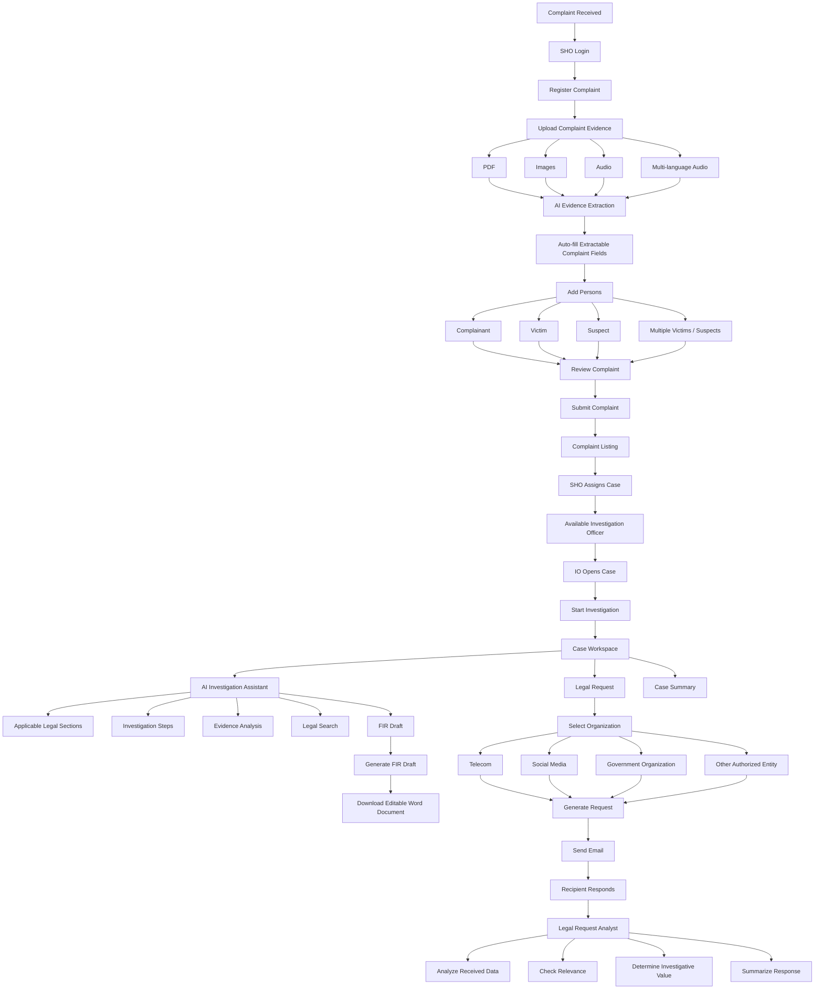

# ⚖️ CrimeOS — AI-Powered Police Investigation & Legal Intelligence Platform

> **CrimeOS** is an AI-powered digital investigation platform designed to modernize police case management, evidence analysis, legal intelligence, investigation planning, and inter-agency data requests.

CrimeOS provides a unified workspace for **Station House Officers (SHOs)** and **Investigation Officers (IOs)**. It transforms the traditional complaint-to-investigation workflow into a structured, AI-assisted digital process.

The platform supports:

* Complaint registration and ingestion
* Multi-language evidence processing
* Automated extraction from documents, images and audio
* Complaint and case management
* Case assignment to Investigation Officers
* AI-powered investigation assistance
* Applicable legal-section suggestions
* Investigation-step recommendations
* Evidence analysis
* FIR draft generation
* Legal data requests to external organizations
* Automated email-based request dispatch
* AI-assisted analysis of received responses
* Comprehensive case summaries
* Semantic legal search
* BNS / BNSS / BSA and historical IPC / CrPC / IEA crosswalks
* Search, filtering and structured case discovery

---

## 🚀 Live Deployment

### Frontend

**CrimeOS Police Portal**

https://crimeos-frontend.onrender.com/

### Backend API

**CrimeOS FastAPI Backend**

https://crimeos.onrender.com/

The frontend communicates with the deployed FastAPI backend to perform authentication, complaint management, investigation workflows, AI processing, legal intelligence, document generation and legal-request operations.

---

# 🎯 Problem Statement

Police investigations involve large amounts of unstructured information distributed across complaints, statements, scanned documents, photographs, audio recordings, legal provisions and communications with external organizations.

Traditional workflows can require officers to:

1. Manually enter complaint information.
2. Read and organize large amounts of evidence.
3. Identify applicable legal sections.
4. Determine suitable investigation steps.
5. Prepare FIR documentation.
6. Send separate requests to telecom operators, social-media platforms and government organizations.
7. Manually examine responses received from those organizations.
8. Maintain and update case information across multiple systems.

This creates significant overhead and makes it difficult to obtain a complete picture of a case quickly.

**CrimeOS addresses this problem by creating one integrated investigation workspace where AI assists officers throughout the complete case lifecycle.**

---

# 💡 Proposed Solution

CrimeOS introduces a role-based investigation platform with two primary users:

### 👮 SHO — Station House Officer

The SHO is responsible for the initial complaint-management workflow.

The SHO can:

* Register complaints.
* Upload complaint-related evidence.
* Review automatically extracted information.
* Add complainants, victims and suspects.
* Add multiple victims and suspects.
* Review the complete complaint before submission.
* View registered complaints.
* Search and filter complaints.
* View all available Investigation Officers.
* Assign cases to available IOs.

### 🕵️ IO — Investigation Officer

The Investigation Officer handles the major investigation workflow.

The IO can:

* View assigned cases.
* Start an investigation.
* View complete case details.
* Analyze evidence using AI.
* Ask the AI assistant for legal guidance.
* Get applicable legal-section suggestions.
* Get recommended investigation steps.
* Search the legal library.
* Generate FIR drafts.
* Download FIR documents.
* Create legal requests.
* Send requests to external organizations.
* Analyze responses received from organizations.
* View comprehensive case summaries.

---

# 🔄 Complete CrimeOS Workflow



---

# 🏗️ System Architecture

CrimeOS consists of three major layers:

```text
┌──────────────────────────────────────────────────────────────┐
│                     CrimeOS Frontend                         │
│                 React / Next.js Application                  │
│                       Port 3000                              │
├──────────────────────────────────────────────────────────────┤
│                                                              │
│  Authentication │ Complaints │ Cases │ AI Assistant          │
│  Evidence       │ Legal      │ FIRs  │ Legal Requests        │
│                                                              │
└──────────────────────────────┬───────────────────────────────┘
                               │ REST API
                               ▼
┌──────────────────────────────────────────────────────────────┐
│                    CrimeOS Backend                            │
│                    FastAPI / Python                           │
│                       Port 8000                              │
├──────────────────────────────────────────────────────────────┤
│                                                              │
│ Authentication │ Complaint Services │ Investigation Engine    │
│ Evidence       │ Legal Intelligence │ Document Generation    │
│ Legal Requests │ Email Services     │ AI Services             │
│                                                              │
└──────────────┬─────────────────┬─────────────────┬────────────┘
               │                 │                 │
               ▼                 ▼                 ▼
        ┌────────────┐    ┌────────────┐    ┌────────────┐
        │ PostgreSQL │    │ AI / ML    │    │ Cloud      │
        │ + pgvector │    │ Services   │    │ Services   │
        └────────────┘    └────────────┘    └────────────┘
               │                 │                 │
               │                 ├─ Gemini          ├─ Cloudinary
               │                 ├─ Groq            └─ SMTP
               │                 ├─ Hugging Face
               │                 ├─ Whisper
               │                 └─ Tesseract
               │
               └── Cases / Users / Evidence /
                   Legal Data / Requests
```

---

# 👥 Role-Based Workflow

## 1. SHO Workflow

The SHO is responsible for converting an incoming complaint into a structured case that can be assigned to an IO.

### Step 1 — Register Complaint

The SHO starts the complaint-registration process.

CrimeOS supports uploading supporting materials such as:

* PDF documents
* Images
* Audio recordings
* Multi-language audio

Audio can include languages such as:

* English
* Hindi
* Gujarati

The uploaded information is processed by the backend and extractable information is used to populate the complaint form.

---

### Step 2 — Complaint Information Extraction

The system extracts relevant information from uploaded evidence wherever possible.

Instead of manually entering every field, the SHO receives automatically extracted information that can be reviewed and edited.

This reduces repetitive data-entry work and helps preserve information from the original complaint material.

---

### Step 3 — Add People Related to the Complaint

CrimeOS provides dedicated person cards for:

* Complainant
* Victim
* Suspect

Multiple victims and multiple suspects can be added to a complaint.

This allows complex complaints involving several individuals to be represented properly.

---

### Step 4 — Review Before Submission

Before submitting the complaint, the SHO receives a final review screen.

The review contains the complete complaint information, including:

* Complaint details
* Extracted information
* Complainant information
* Victim information
* Suspect information
* Uploaded evidence
* Other relevant fields

The SHO can verify the information before submitting the complaint.

---

### Step 5 — Complaint Listing

After submission, complaints appear in the complaint listing.

The complaint listing provides a centralized view of the information received during complaint ingestion.

The SHO can:

* Search complaints.
* Filter complaints.
* View complaint information.
* Review ingestion results.
* Identify complaints that need assignment.

---

### Step 6 — Assign Complaint to an IO

The SHO can view available Investigation Officers and assign a complaint to an appropriate IO.

Once assigned, the complaint becomes an investigation case for the selected IO.

---

# 🕵️ 2. IO Investigation Workflow

The Investigation Officer is the primary user of the investigation intelligence features.

After receiving an assigned case, the IO can open the case workspace and start the investigation.

---

## Case Workspace

The case workspace provides a centralized view of the investigation.

It can contain:

* Complaint information
* Complainant
* Victims
* Suspects
* Evidence
* Investigation information
* Legal intelligence
* Legal requests
* AI-generated analysis
* FIR drafts
* Case summary

Cases also support search and filtering functionality to help officers locate relevant cases efficiently.

---

# 🤖 AI Investigation Assistant

The AI Assistant is one of the core components of CrimeOS.

It helps the IO perform investigation-related tasks without manually searching through multiple sources.

The assistant can provide:

### 1. Applicable Legal Sections

Based on the case information, the AI assistant can suggest potentially applicable legal sections.

CrimeOS also provides semantic legal search to identify relevant provisions from the legal database.

The legal intelligence layer is designed around:

* BNS
* BNSS
* BSA
* Historical IPC
* Historical CrPC
* Historical IEA

This enables officers to understand both current provisions and their historical counterparts.

> AI-generated legal suggestions are intended as decision-support and should be reviewed by authorized personnel before being relied upon for official legal action.

---

### 2. Investigation Step Suggestions

The IO can provide the case context to the AI assistant.

The assistant analyzes the available information and suggests investigation steps relevant to the case.

This can help officers structure the investigation and identify potentially useful investigative directions.

---

### 3. Evidence Analysis

CrimeOS allows the IO to provide case-related evidence to the AI system.

Supported evidence can include:

* Images
* PDFs
* Audio
* Extracted text
* Other case-related documents

The evidence ingestion pipeline can perform:

```text
Evidence
   ↓
Upload
   ↓
OCR / Transcription
   ↓
Text Extraction
   ↓
AI Analysis
   ↓
Structured Information
   ↓
Investigation Workspace
```

### Audio

Audio evidence can be transcribed using Whisper.

### Images

Images and scanned documents can be processed using OCR.

### PDFs

PDF content can be extracted and passed to the AI processing pipeline.

The resulting analysis is presented to the IO as investigation-supporting information.

---

# 📚 Legal Intelligence Center

CrimeOS includes a semantic legal-search system.

Instead of relying only on exact keyword matching, officers can search using natural-language descriptions of a case.

Example:

```text
"Person threatened another person through repeated messages
and demanded money."

        ↓

Semantic Search

        ↓

Relevant Legal Sections
```

The system uses embeddings and vector similarity search to identify relevant legal content.

### Legal Intelligence Pipeline

```text
Officer Query
      ↓
Embedding Generation
      ↓
Vector Similarity Search
      ↓
Relevant Legal Sections
      ↓
Old/New Act Crosswalk
      ↓
AI Synthesis
      ↓
Investigation Guidance
```

The system uses:

* Hugging Face embeddings
* PostgreSQL
* pgvector
* Legal-section datasets
* Old/new act mappings
* LLM-based synthesis

---

# 📄 FIR Draft Generation

The AI Assistant also provides an option to generate an FIR draft.

The workflow is:

```text
Case Information
      ↓
AI Analysis
      ↓
Suggested Legal Sections
      ↓
Officer Selects / Reviews Sections
      ↓
Generate FIR Draft
      ↓
Editable Word Document
```

The generated FIR can be downloaded as a `.docx` file.

The officer can review and edit the generated document before using it for official purposes.

---

# 📡 Legal Request Management

CrimeOS provides a dedicated Legal Request feature for requesting case-related information from external organizations.

Potential recipients include:

* Telecom operators
* Social-media platforms
* Government organizations
* Other relevant authorized entities

---

## Legal Request Workflow

```text
IO Creates Legal Request
          ↓
Select Recipient Organization
          ↓
Enter Required Information
          ↓
Generate Official Request
          ↓
Generate PDF
          ↓
Upload / Store Document
          ↓
Send Email
          ↓
Recipient Receives Request
          ↓
Recipient Replies
          ↓
Response Analysis
```

The generated request can be converted into a PDF and dispatched to the recipient's email address.

CrimeOS uses SMTP email delivery for sending the request.

---

# 📬 Legal Request Response Analyst

A major feature of CrimeOS is the ability to analyze the response received after a legal request is sent.

When the recipient responds, the response can be analyzed by the Legal Request Analyst.

The system helps determine:

### What data was received?

The analyst extracts and summarizes the important information from the response.

### Is the received data relevant?

The system evaluates whether the response contains information relevant to the original investigation/request.

### How can the data help the investigation?

The analysis identifies the potential investigative value of the received information.

### Was the requested information provided?

The response can be compared against the original request to determine whether the received information addresses the requested data.

### Response Analysis Flow

```text
Original Legal Request
          ↓
Recipient Response
          ↓
Response Extraction
          ↓
AI Analysis
          ↓
┌───────────────────────────────┐
│ Data Received                 │
│ Relevance                     │
│ Missing Information           │
│ Investigative Value           │
│ Important Findings            │
└───────────────────────────────┘
          ↓
Investigation Workspace
```

This converts a potentially lengthy external response into actionable investigation intelligence.

---

# 📋 Case Summary

CrimeOS provides a comprehensive case-summary view.

The case summary brings together the information accumulated throughout the investigation.

It can include:

* Complaint details
* Complainant details
* Victim details
* Suspect details
* Evidence
* Evidence analysis
* Applicable legal sections
* Investigation suggestions
* Legal requests
* Received responses
* Response analysis
* FIR information
* Other investigation data

The goal is to provide the IO with a single consolidated view of the case.

---

# 🧠 AI / ML Architecture

CrimeOS uses multiple AI components for different tasks rather than relying on a single model.

## Evidence Processing

| Component          | Purpose                                       |
| ------------------ | --------------------------------------------- |
| Whisper            | Audio transcription                           |
| Tesseract OCR      | Text extraction from images/scanned documents |
| PDFPlumber         | PDF text extraction                           |
| Gemini             | Evidence extraction, structuring and merging  |
| Combo Master Agent | Consolidation of extracted evidence           |

---

## Legal Intelligence

| Component                  | Purpose                                  |
| -------------------------- | ---------------------------------------- |
| Hugging Face E5 Embeddings | Semantic representation of legal queries |
| pgvector                   | Vector similarity search                 |
| Legal Crosswalk            | Old/new legal act mapping                |
| Groq                       | AI synthesis and investigation guidance  |

---

## Document Generation

| Component   | Purpose                      |
| ----------- | ---------------------------- |
| python-docx | FIR Word document generation |
| ReportLab   | PDF generation               |
| Cloudinary  | Document storage/CDN         |
| SMTP        | Email dispatch               |

---

# 🛠️ Technology Stack

## Frontend

* Next.js
* React
* TypeScript / JavaScript
* Tailwind CSS

## Backend

* Python
* FastAPI
* Uvicorn
* SQLAlchemy
* Pydantic

## Database

* PostgreSQL
* Neon Serverless PostgreSQL
* pgvector

## AI / ML

* Google Gemini
* Groq
* Hugging Face
* E5 embeddings
* OpenAI Whisper
* Tesseract OCR

## Document Processing

* PDFPlumber
* ReportLab
* python-docx

## Infrastructure

* Render
* Cloudinary
* SMTP

---

# 📁 Project Structure

```text
CrimeOS/
│
├── frontend/
│   ├── app/
│   ├── components/
│   ├── hooks/
│   ├── lib/
│   ├── services/
│   ├── public/
│   ├── package.json
│   └── ...
│
└── backend/
    │
    ├── app/
    │   ├── config/
    │   │   └── Configuration and external service clients
    │   │
    │   ├── core/
    │   │   └── Authentication and security utilities
    │   │
    │   ├── routes/
    │   │   ├── Authentication
    │   │   ├── Complaints
    │   │   ├── Evidence ingestion
    │   │   ├── Cases
    │   │   ├── Legal intelligence
    │   │   ├── FIR drafts
    │   │   └── Legal requests
    │   │
    │   ├── schemas/
    │   │   └── Pydantic validation schemas
    │   │
    │   ├── services/
    │   │   ├── Complaint services
    │   │   ├── Evidence ingestion
    │   │   ├── AI services
    │   │   ├── Legal request services
    │   │   ├── Email services
    │   │   └── Document generation
    │   │
    │   └── main.py
    │
    ├── database/
    │   ├── db.py
    │   └── init_db.py
    │
    ├── investigation/
    │   ├── tests/
    │   ├── embedding.py
    │   ├── legal_library_router.py
    │   ├── llm_synthesis.py
    │   ├── query_builder.py
    │   ├── retrieval.py
    │   └── README.md
    │
    ├── models/
    │   └── SQLAlchemy models
    │
    ├── scripts/
    │   ├── seed_db.py
    │   ├── seed_landmarks.py
    │   └── seed_mappings.py
    │
    ├── .env
    └── requirements.txt
```

---

# 🔐 Authentication & Authorization

CrimeOS uses role-based authentication.

The two primary roles are:

```text
                 CrimeOS
                    │
          ┌─────────┴─────────┐
          │                   │
         SHO                  IO
          │                   │
   Complaint Management   Investigation
          │                   │
   Assign Cases          AI Assistant
                          Evidence Analysis
                          Legal Requests
                          FIR Generation
                          Case Summary
```

Authentication is handled through JWT-based authentication.

Role-based access control ensures that users can access functionality appropriate to their role.

---

# 📡 API Routing Reference

| Category           | Endpoint                                               | Method | Description                     |
| ------------------ | ------------------------------------------------------ | -----: | ------------------------------- |
| Authentication     | `/auth/register`                                       |   POST | Register officer                |
| Authentication     | `/auth/login`                                          |   POST | Authenticate officer            |
| Complaints         | `/api/complaints`                                      |   POST | Register complaint              |
| Complaints         | `/api/complaints`                                      |    GET | Retrieve complaints             |
| Complaints         | `/api/complaints/io`                                   |    GET | Get available IOs               |
| Complaints         | `/api/complaints/categories`                           |    GET | Get crime categories            |
| Complaints         | `/api/complaints/{id}/assign`                          |   POST | Assign complaint to IO          |
| Evidence           | `/api/v1/audio/upload`                                 |   POST | Upload/transcribe audio         |
| Evidence           | `/api/v1/pdf/upload`                                   |   POST | Extract PDF text                |
| Evidence           | `/api/v1/image/upload`                                 |   POST | OCR image                       |
| Evidence           | `/api/v1/combo/merge/`                                 |   POST | Merge evidence into case        |
| Legal Intelligence | `/api/legal-library/search`                            |    GET | Semantic legal search           |
| Investigation      | `/investigation/cases/{case_id}/suggest-investigation` |   POST | Generate investigation guidance |
| FIR                | `/api/fir-drafts`                                      |   POST | Save FIR draft                  |
| FIR                | `/api/fir-drafts`                                      |    GET | Retrieve FIR drafts             |
| FIR                | `/api/fir-drafts/{id}/download`                        |    GET | Download FIR `.docx`            |
| Legal Requests     | `/api/legal-requests`                                  |   POST | Create legal request            |
| Legal Requests     | `/api/legal-requests/{id}/generate`                    |   POST | Generate request PDF            |
| Legal Requests     | `/api/legal-requests/{id}/send`                        |   POST | Send request via email          |

---

# 🗄️ Database

CrimeOS uses PostgreSQL as its primary relational database.

The deployed system uses **Neon Serverless PostgreSQL**.

The database stores structured information associated with:

* Users
* Roles
* Complaints
* Cases
* Complainants
* Victims
* Suspects
* Evidence
* Legal sections
* Legal mappings
* FIR drafts
* Legal requests
* Request responses
* Investigation information
* Vector embeddings

`pgvector` is used for semantic similarity search over legal information.

---

# 🔍 Semantic Legal Search

CrimeOS converts legal queries into vector representations and searches the legal knowledge base using cosine similarity.

```text
Natural Language Query
        ↓
E5 Embedding Model
        ↓
1024-dimensional Vector
        ↓
PostgreSQL + pgvector
        ↓
Cosine Similarity
        ↓
Relevant Legal Sections
        ↓
Crosswalk Mapping
        ↓
AI-generated Explanation
```

This allows an officer to search using the **meaning of a case description**, rather than requiring an exact legal keyword.

---

# 🔐 Environment Configuration

Create:

```text
backend/.env
```

Example:

```env
DATABASE_URL=postgresql://<user>:<password>@<host>/<database>?sslmode=require

JWT_SECRET_KEY=your_jwt_signing_secret
JWT_ALGORITHM=HS256
ACCESS_TOKEN_EXPIRE_MINUTES=60

GEMINI_API_KEY=your_gemini_api_key
GOOGLE_API_KEY=your_google_api_key
GROQ_API_KEY=your_groq_api_key
HF_API_TOKEN=your_huggingface_token

CLOUDINARY_CLOUD_NAME=your_cloudinary_name
CLOUDINARY_API_KEY=your_cloudinary_api_key
CLOUDINARY_API_SECRET=your_cloudinary_api_secret

SMTP_HOST=smtp.gmail.com
SMTP_PORT=587
SMTP_USERNAME=your_email@gmail.com
SMTP_PASSWORD=your_gmail_app_password
SMTP_FROM=your_email@gmail.com
```

**Never commit the actual `.env` file or API credentials to version control.**

---

# ⚙️ Local Installation

## Prerequisites

Install:

* Python
* Node.js
* PostgreSQL / Neon database
* Git

---

## 1. Clone Repository

```bash
git clone <repository-url>
cd CrimeOS
```

---

## 2. Backend Setup

```bash
cd backend

python -m venv venv
```

### Windows

```bash
venv\Scripts\activate
```

### Linux/macOS

```bash
source venv/bin/activate
```

Install dependencies:

```bash
pip install -r requirements.txt
```

Configure the `.env` file.

---

## 3. Seed Legal Database

Run:

```bash
python scripts/seed_db.py
```

```bash
python scripts/seed_landmarks.py
```

```bash
python scripts/seed_mappings.py --csv-dir ./scripts
```

These scripts populate the legal knowledge base, landmark cases and old/new act mappings.

---

## 4. Start Backend

```bash
uvicorn app.main:app --reload --port 8000
```

Backend:

```text
http://localhost:8000
```

---

## 5. Frontend Setup

Open another terminal:

```bash
cd frontend
npm install
npm run dev
```

Frontend:

```text
http://localhost:3000
```

---

# 🧪 Testing

Backend tests can be executed using:

```bash
pytest investigation/tests/
```

The tests verify investigation and legal-query related backend functionality.

---

# ☁️ Deployment

The current deployment consists of:

```text
                 Internet
                    │
                    ▼
        ┌──────────────────────┐
        │ CrimeOS Frontend     │
        │      Render          │
        └──────────┬───────────┘
                   │
                   │ HTTPS API
                   ▼
        ┌──────────────────────┐
        │ CrimeOS Backend      │
        │      Render          │
        └──────────┬───────────┘
                   │
       ┌───────────┼────────────┐
       ▼           ▼            ▼
    Neon DB    AI Services   Cloudinary
       │
       └──── pgvector
```

### Deployed Frontend

https://crimeos-frontend.onrender.com/

### Deployed Backend

https://crimeos.onrender.com/

Environment variables and API credentials should be configured in the deployment platform rather than committed to the repository.

---

# 🌟 Key Features

## Complaint Management

* Role-based complaint registration
* Evidence-assisted complaint entry
* Multi-language audio ingestion
* PDF and image processing
* Automatic field extraction
* Multiple complainants/victims/suspects
* Complaint review before submission
* Search and filtering

## Case Management

* SHO-to-IO assignment
* Available IO discovery
* Case workspace
* Investigation status
* Case search
* Case filtering
* Consolidated case information

## AI Investigation Assistant

* Applicable legal-section suggestions
* Investigation-step recommendations
* Evidence analysis
* Case-aware AI assistance
* Legal semantic search
* FIR draft generation

## Evidence Intelligence

* Audio transcription
* OCR
* PDF extraction
* Structured evidence extraction
* Evidence merging
* AI-based evidence analysis

## Legal Intelligence

* Semantic legal search
* BNS / BNSS / BSA support
* Historical IPC / CrPC / IEA crosswalk
* Legal-section retrieval
* AI synthesis

## FIR Generation

* AI-assisted FIR drafting
* Officer review
* Selected legal sections
* Editable `.docx` generation

## Legal Requests

* Generate official request
* Request external case-related information
* PDF generation
* Email dispatch
* Recipient response handling
* AI response analysis
* Relevance assessment
* Investigative-value assessment

## Case Intelligence

* Complete case summary
* Evidence overview
* Legal information
* Investigation guidance
* Legal request history
* Response analysis
* FIR information

---

# 💡 Innovation & Unique Value Proposition

CrimeOS is not simply a case-management application.

It creates an **AI-assisted investigation lifecycle**:

```text
Complaint
   ↓
Evidence
   ↓
Structured Case
   ↓
Investigation
   ↓
AI Legal Intelligence
   ↓
Evidence Analysis
   ↓
Investigation Guidance
   ↓
External Data Request
   ↓
Response Analysis
   ↓
Case Intelligence
   ↓
FIR Draft
   ↓
Comprehensive Case Summary
```

The key differentiator is the integration of these workflows into a single investigation platform.

Instead of treating complaint registration, evidence processing, legal research, investigation planning, FIR drafting and external information requests as separate tasks, CrimeOS connects them through the same case workspace.

---

# 🔒 Security & Responsible AI

CrimeOS is designed for sensitive investigation workflows.

Important principles include:

* JWT-based authentication
* Role-based authorization
* Protected API routes
* Environment-based secret management
* No API keys committed to source control
* Controlled access to case information
* Officer review of AI-generated outputs

AI-generated legal and investigative suggestions are **decision-support tools**, not replacements for authorized police officers, investigators, lawyers or judicial authorities.

Official decisions and legal actions should always be verified by the responsible personnel.

---

# 🔮 Future Scope

Potential future enhancements include:

* Advanced case-to-case relationship discovery
* Criminal network analysis
* Timeline generation from evidence
* Entity relationship graphs
* Advanced multilingual support
* Additional Indian-language speech processing
* Improved evidence provenance tracking
* Automated investigation timelines
* Geographic crime intelligence
* Predictive resource allocation
* Advanced forensic evidence correlation
* Mobile application for field officers
* Offline-first field investigation support
* Integration with additional authorized government systems
* Advanced notification and escalation workflows

---

# 🏆 Project Impact

CrimeOS aims to reduce the administrative burden on police officers and help investigators spend more time on actual investigation.

The platform brings together:

**Complaint → Evidence → Case → AI Assistance → Investigation → Legal Requests → Response Analysis → FIR → Case Summary**

into one unified workflow.

This creates a more structured, searchable and intelligence-driven investigation environment.

---

# 📜 Legal & Data Disclaimer

CrimeOS is a prototype developed for the E-Rakshak Hackathon.

The platform provides AI-assisted information retrieval, evidence analysis and investigation support. AI-generated outputs may contain errors and must be reviewed by authorized personnel before being used for official legal or investigative decisions.

All third-party APIs, libraries, models and datasets used by the project should be configured and used according to their respective licenses and terms.

---

# 👨‍💻 Development & Contribution

The project is developed as a collaborative hackathon prototype.

Contributions should maintain:

* Clear separation between frontend and backend
* Secure handling of credentials
* Validated API inputs
* Proper error handling
* Consistent database models
* Test coverage for critical backend functionality
* Documentation for new APIs and features

---

# 📌 Quick Links

| Resource            | Link                                   |
| ------------------- | -------------------------------------- |
| 🌐 CrimeOS Frontend | https://crimeos-frontend.onrender.com/ |
| ⚙️ CrimeOS Backend  | https://crimeos.onrender.com/          |

---

# ❤️ CrimeOS

### **From Complaint to Investigation Intelligence — One Case, One Workspace.**
